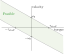

Joint, velocity and torque limits
=================================

Torque limits
-------------

Torque limits are **disabled by default**. They enforce the robot torque limits
presents in the URDF or :ref:`overriden by the user <joint_limits>`.

You can enable/disable those limits with:

.. code-block:: python

    # Disables torque limits (disabled by default)
    solver.enable_torque_limits(False)

Floating base
-------------

The floating base torque is enforced by default to be zero. In the case you want your floating base to be
fixed (for example, for a fixed arm manipulator), you can use :func:`mask_fbase <placo.DynamicsSolver.mask_fbase>`:

.. code-block:: python

    # Fix the floating base
    solver.mask_fbase(True)

In that case, the floating base acceleration will be imposed to zero, and its torque will not be imposed to zero,
allowing it to compensate for forces like gravity.

Velocity limits
---------------

You can enable the velocity limits (**disabled by default**). They enfore the robot velocity limits
presents in the URDF or :ref:`overriden by the user <joint_limits>`.

.. code-block:: python

    # Enables velocity limits (disabled by default)
    solver.enable_velocity_limits(True)

Velocity vs torque inequalities
-------------------------------

Robots are typically actuated by electric motors, which torque limits are dependent on the current velocity.
This duality can also be imposed by using :func:`enable_velocity_vs_torque_limits <placo.DynamicsSolver.enable_velocity_vs_torque_limits>`:

.. code-block:: python

    # Enables velocity vs torque limits (disabled by default)
    solver.enable_velocity_vs_torque_limits(True)

Enabling this limit will **replace** the velocity limit.
Without torque limits enabled, here is the constraint enforced:

In this case, the robot's maximum torque is used as :math:`\tau_{stall}`, and maximum velocity as :math:`\omega_0`.
If you also enable torque limits, the following will happen:

You might want to have a maximum allowable torque lower than the stall torque.
Typically, the stall torque might yield very high current and heat dissipation, which is not desirable.
However, the stall torque is still necessary to compute the velocity vs torque limit (:math:`\tau_{stall}`).
In that case, you can override the maximum torque using:

.. code-block:: python

    # Override the maximum torque to 0.5 Nm for the left_shoulder_pitch joint
    solver.set_torque_limit("left_shoulder_pitch", 0.5)

This will **not** change the effort limits in the robot model.
As a result, the following restriction will be enforced:

.. admonition:: Using DC motor characteristics

    Assume you know DC motor characteristics:

    * :math:`k_t`: torque constant [Nm/A]
    * :math:`R`: motor resistance [Ohm]
    * :math:`V_{in}`: input voltage [V]
    * Optionally :math:`I_{max}`, the maximum current [A]

    You can set the following limits:

    * :math:`\tau_{stall} = k_t V_{in} / R`: stall torque, ``effort`` in the URDF, or using :func:`set_torque_limit() <placo.RobotWrapper.set_torque_limit>`.
    * :math:`\omega_0 = V_{in} / k_t`: no-load speed, ``velocity`` in the URDF, or using :func:`set_velocity_limit() <placo.RobotWrapper.set_velocity_limit>`.
    * Optionally, pass :math:`\tau_{max} = kt \times I_{max}` to the solver's :func:`set_torque_limit() <placo.DynamicsSolver.set_torque_limit>` to set the maximum torque allowable (e.g because of heat).

    To recover the DC motor limits, that are:

    .. math::

        \tau \in [-\frac{k_t}{R} V_{in} - \frac{k_t^2}{R} \omega, \frac{k_t}{R} V_{in} - \frac{k_t^2}{R} \omega]

    You can use the following equation to recover either :math:`I` or :math:`U` from the computed torque:

    * :math:`I = \frac{\tau}{k_t}`: current
    * :math:`U = R I + k_t \omega`: voltage

Joint limits
------------

You can enable joint limits, that are **disabled by default**. They enfore the robot joint limits
presents in the URDF or :ref:`overriden by the user <joint_limits>`.

.. code-block:: python

    # Enables joint limits (disabled by default)
    solver.enable_joint_limits(True) # Read carefully below

Enforcing the joint limits in a dynamics formulation is trickier. In practice, the joint limits are enforced
by generating limits on the future velocity.

You **need** to define a **safe acceleration** limit for each joints, which is internally set to 1 by default,
and can be set by the user with:

.. code-block:: python

    # Sets a safe acceleration that is supposed to be always available [rad/s^2]
    # if you don't call this method, a default internal value of 1 rad/s^2 is used
    solver.set_qdd_safe("left_shoulder_pitch", 1.5)

.. admonition:: Math details

    Denoting the safe acceleration :math:`\ddot q_{safe}`, the solver will enforce the following.

    If the joint is not currently excedding its limit :math:`q_{max}` (or :math:`q_{min}`), the acceleration is
    constrained by:

    .. math::

        \dot q + \ddot q \Delta t \le \sqrt{2 \ddot q_{safe} \Delta q_{max}}.

    This ensures that the velocity towards the joint limit can't exceed a value such that the safe acceleration
    won't be able to take the joint to a stop before hitting it.

    If the joint is currently excedding its limit :math:`q_{max}` (or :math:`q_{min}`), the solver will enforce
    at least the safe acceleration outwards the constraint. For example, if :math:`q > q_{max}`, the following
    inequality will be added:

    .. math::

        \ddot q \le -\ddot q_{safe}

    This situation can happen during initialization, or because of numerical inaccuracies.